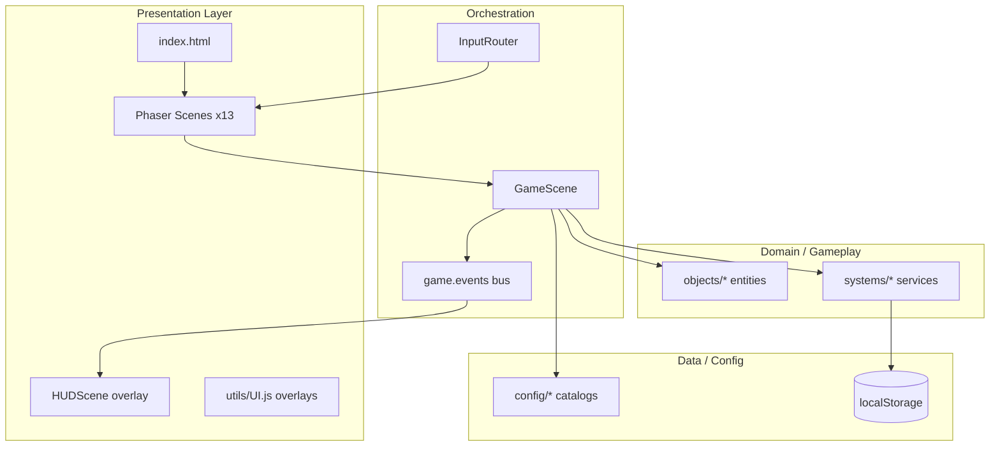
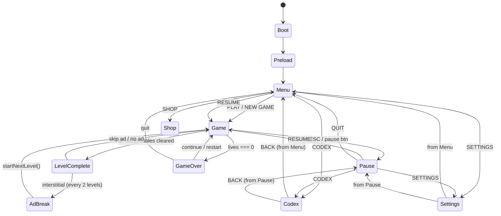
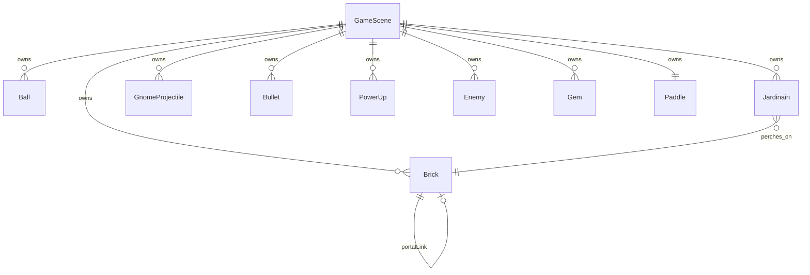
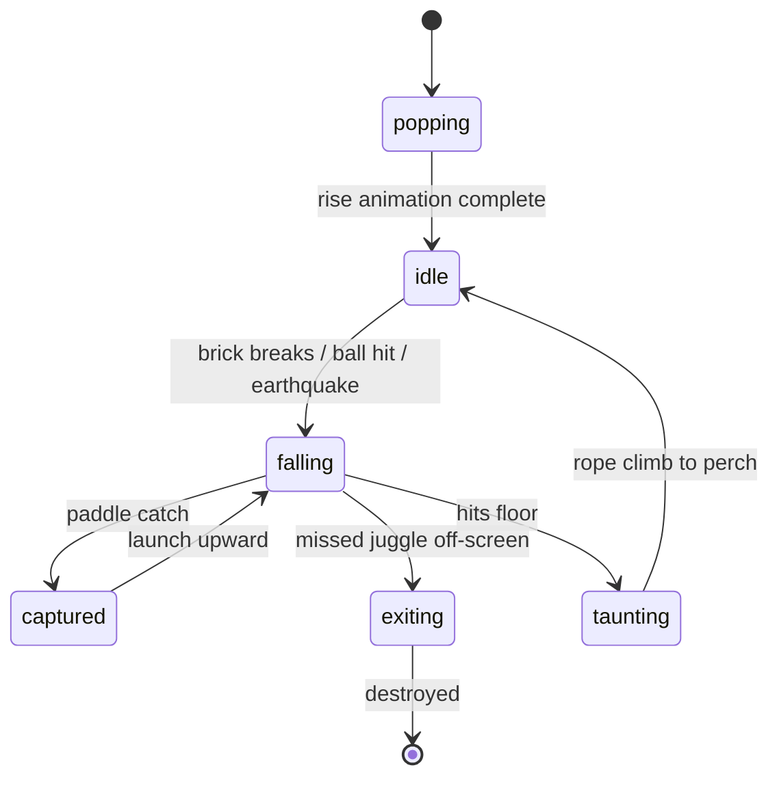
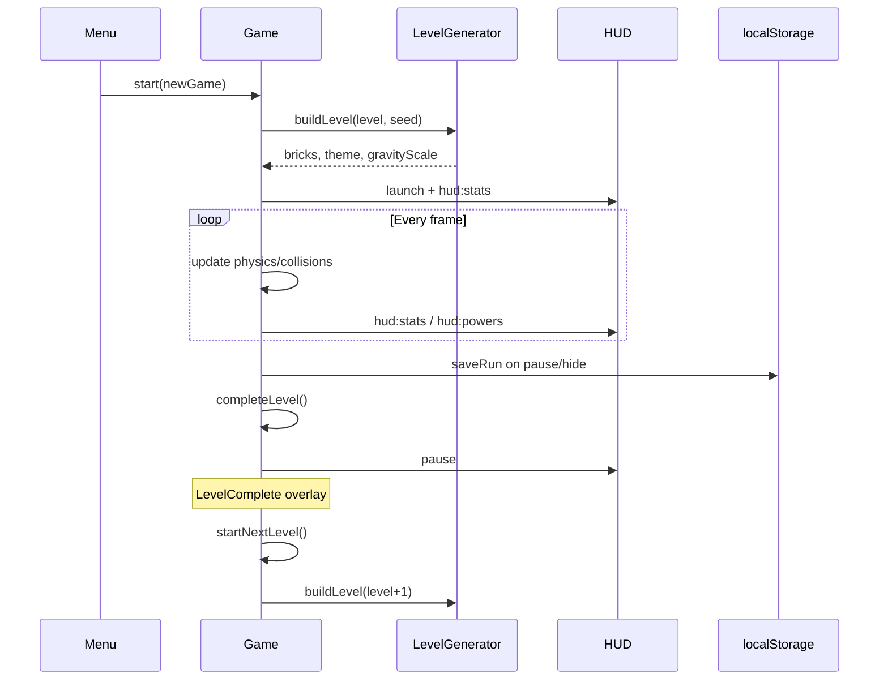
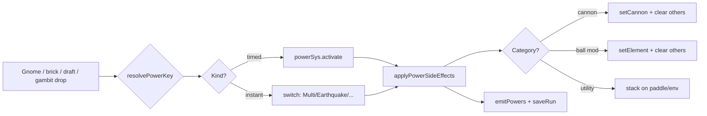

# Neon Nexus: Bullet-Time Brick Breaker

**System architecture & complete repository documentation**

| | |
|---|---|
| **Version** | 2.0.0 |
| **Engine** | [Phaser 4.1.0](https://phaser.io/v401) (WebGL \| Web Audio) |
| **Bundler** | Vite 8 |
| **Platforms** | Web (PWA), Capacitor (iOS/Android) |
| **License** | MIT |

This document is the single canonical reference for how the repository is organized, how subsystems interact, and how gameplay is implemented. For player-facing rules, see [`GAME_MECHANICS.md`](./GAME_MECHANICS.md), [`HowToPlay.js`](../src/config/HowToPlay.js), and the in-game Codex. Index: [`README.md`](./README.md).

---

## Table of contents

1. [Executive summary](#1-executive-summary)
2. [Repository layout](#2-repository-layout)
3. [Runtime bootstrap](#3-runtime-bootstrap)
4. [System architecture](#4-system-architecture)
5. [Scene graph & navigation](#5-scene-graph--navigation)
6. [Game loop & update pipeline](#6-game-loop--update-pipeline)
7. [Entity layer (objects)](#7-entity-layer-objects)
8. [Systems layer](#8-systems-layer)
9. [Configuration layer](#9-configuration-layer)
10. [Utilities & assets](#10-utilities--assets)
11. [Physics & collision](#11-physics--collision)
12. [Power-up catalog](#12-power-up-catalog)
13. [Jardinain (gnome) engine](#13-jardinain-gnome-engine)
14. [Brick types & level generation](#14-brick-types--level-generation)
15. [Event bus & HUD contract](#15-event-bus--hud-contract)
16. [Persistence & save format](#16-persistence--save-format)
17. [Input, overlays & pause](#17-input-overlays--pause)
18. [Audio, VFX & animation](#18-audio-vfx--animation)
19. [Build, test & deploy](#19-build-test--deploy)
20. [Dependencies](#20-dependencies)
21. [Legacy & docs drift](#21-legacy--docs-drift)
22. [File index](#22-file-index)

---

## 1. Executive summary

Neon Nexus is a **Jardinains-inspired** brick breaker: break bricks, knock tiered garden gnomes off their perches, juggle them for exponential score, and collect **44 power keys** (including tier-II fusion variants) from gnomes, streak drafts, combo gambits, and tactical brick drops. The game uses **custom AABB/circle physics** (not Phaser Arcade), **procedural level generation** with seeded RNG, **level goals & mutators**, **Nexus/bullet-time meter**, **meta progression** (treasury, journal), and a **parallel HUD scene** with vertical side meters driven by a global event bus.

Design pillars:

- **Responsive canvas** — fixed 1280px logical height; portrait width = `H × aspect` (no 720 clamp); desktop may letterbox under `Scale.FIT`.
- **Pause-safe timers** — power expiry uses frame delta, not wall clock alone.
- **Run + meta persistence** — mid-game save/resume (`nn_run_v1`, 7-day TTL) and long-term meta (`nn_meta_v1`).
- **Zero external art pipeline** — textures and Lucide icons rasterized at boot.
- **Weapon vs utility stacking** — one cannon + one ball mod at a time; paddle/env powers stack; fusion upgrades duplicate picks to tier II.

---

## 2. Repository layout

```
Neon-Nexus-Bullet-Time-Brickbreaker/
├── index.html                 # Shell, fonts, boot splash, module entry
├── vite.config.js             # Vite: base './', Phaser manual chunk
├── package.json               # Scripts & dependencies
├── capacitor.config.json      # Native wrapper (webDir: dist)
│
├── docs/
│   ├── README.md              # Docs index & quick facts
│   ├── ARCHITECTURE.md        # ← this file
│   ├── GAME_MECHANICS.md      # Player-facing v2 mechanics
│   └── REDESIGN.md            # Product roadmap & monetization map
│
├── public/
│   ├── manifest.json          # PWA manifest
│   ├── sw.js                  # Service worker (production)
│   ├── icons/android/         # Generated launcher icons
│   └── images/                # SVG HUD assets (pause, heart, settings)
│
├── scripts/
│   ├── smoke.mjs              # Headless Puppeteer integration test
│   ├── gen-icons.mjs          # PNG icon generator (prebuild)
│   ├── screenshot.mjs
│   ├── visualcheck.mjs
│   └── diag.mjs
│
├── src/                       # ★ Active game source
│   ├── main.js                # Phaser bootstrap
│   ├── config/                # Tunables, catalogs, themes
│   ├── objects/               # Render + state for entities
│   ├── systems/               # Stateless / service logic
│   ├── scenes/                # Phaser scenes (screens)
│   └── utils/                 # Textures, UI helpers, noise
│
└── legacy/                    # Original canvas prototype (reference only)
    ├── typescript/app.js
    ├── typescript/worker.js
    └── vendor/
```

**60 source files** under `src/` (excluding tests). The `legacy/` tree is not imported by the Vite build.

---

## 3. Runtime bootstrap

### 3.1 Load sequence

```
index.html
  └── src/main.js
        ├── computeLayout(w, h)     → sets GAME.WIDTH, responsive constants
        ├── new Phaser.Game(config)
        └── on READY:
              ├── InputRouter.attach(game)
              ├── RunPersistence.attachAutoSave(game)
              ├── Monetization.register(createDemoAdProvider())
              └── hide #boot-splash
```

### 3.2 Phaser configuration (`src/main.js`)

| Setting | Value |
|---------|-------|
| Renderer | `Phaser.AUTO` |
| Scale mode | `FIT`, centered |
| Logical size | `GAME.WIDTH × GAME.HEIGHT` (post-`computeLayout`) |
| Target FPS | 60 (min 30) |
| Scene list | 13 scenes (see §5) |
| Global handle | `window.__NEON` |

### 3.3 Responsive layout (`computeLayout` in `Constants.js`)

- **Height** fixed at **1280** logical px.
- **Width** = `round(H × aspect)` on portrait (no 720 min); desktop uses `clamp(H × aspect, 560, 2200)`.
- **Wall top** = 11% of height on portrait (was 14%) for more playfield.
- Scales: paddle width, ball speed/radius, brick cell size, wall insets, gnome gravity, power-up fall speed.
- **Resize**: `LayoutManager.syncViewportLayout()` + relayout; HUD restarts on logical size change.
- Optional **P1 ENVELOP** (dynamic H) not implemented — see `REDESIGN.md`.

### 3.4 Production extras

- Service worker: `public/sw.js` (registered only when `import.meta.env.PROD`).
- Capacitor detects native platform for monetization stub naming.

### 3.5 Monetization (demo provider — swap for production)

| Touchpoint | File | Method |
|------------|------|--------|
| Provider registration | `main.js` | `Monetization.register(createDemoAdProvider())` |
| Demo ads | `DemoAdProvider.js` | Simulated rewarded/interstitial + DOM banner |
| Interstitial UI | `AdBreakScene.js` | Overlay between levels |
| Rewarded continue / revive | `GameOverScene.js` | `offerRewardedContinue()`, revive + 2 powers |
| 2× clear bonus | `LevelCompleteScene.js` | Rewarded double treasury |
| Interstitial cadence | `GameScene.js` `completeLevel()` | Every 2 levels, 90s frequency cap |
| Shop / cosmetics | `ShopScene.js` | Paddle hulls, ball trails, themes |
| IAP catalog | `Monetization.js` | `remove_ads`, `coins_small`, `premium` |
| Remove ads persistence | `SaveManager` + `Monetization.purchase` | `STORAGE.REMOVE_ADS` |
| Banner slot | `index.html` `#ad-banner` | Shown on Menu when ads enabled |

---

## 4. System architecture

High-level layering:



### Responsibility matrix

| Layer | Responsibility | Mutates game state? |
|-------|----------------|---------------------|
| **Scenes** | Screen flow, overlay lifecycle, input routing | Yes (via GameScene) |
| **Objects** | Entity position, visuals, per-entity flags | Yes (local) |
| **Systems** | Timers, generation, audio, save I/O | Yes (via scene ref) |
| **Config** | Constants, catalogs, themes | No (read-only) |
| **Utils** | Texture gen, UI widgets, math | No |

**GameScene** is the sole owner of the live match: entity arrays, collision resolution, scoring, and power application. All other scenes are menus, overlays, or read-only HUD.

---

## 5. Scene graph & navigation

Scene keys are defined in `src/config/Constants.js` → `SCENES`.

| Key | Class | File | Role |
|-----|-------|------|------|
| `Boot` | BootScene | `scenes/BootScene.js` | Procedural texture + Lucide icon generation |
| `Preload` | PreloadScene | `scenes/PreloadScene.js` | Load SVG HUD assets → Menu |
| `Menu` | MenuScene | `scenes/MenuScene.js` | Title, Play, Resume, Shop, Codex, Settings |
| `Game` | GameScene | `scenes/GameScene.js` | **Core simulation** |
| `HUD` | HUDScene | `scenes/HUDScene.js` | Top bar + left/right vertical meters, power chips |
| `Pause` | PauseScene | `scenes/PauseScene.js` | Resume, Codex, Settings, Quit |
| `Settings` | SettingsScene | `scenes/SettingsScene.js` | Audio/FX toggles, immersive HUD, shop link |
| `GameOver` | GameOverScene | `scenes/GameOverScene.js` | Final score, rewarded continue/revive, restart |
| `LevelComplete` | LevelCompleteScene | `scenes/LevelCompleteScene.js` | Stars, treasury, 2× bonus, next level |
| `Codex` | CodexScene | `scenes/CodexScene.js` | How-to-play, powers, gnomes, **journal** tab |
| `Shop` | ShopScene | `scenes/ShopScene.js` | Cosmetics + IAP |
| `Purchase` | PurchaseScene | `scenes/PurchaseScene.js` | Demo checkout modal (launched over Shop/Settings) |
| `AdBreak` | AdBreakScene | `scenes/AdBreakScene.js` | Interstitial overlay |

### Navigation diagram



**Parallel scenes**: When `Game` runs, `HUD` is launched alongside it. Overlay scenes (`Pause`, `Settings`, etc.) pause `Game` + `HUD` via `InputRouter`. `Purchase` is a **sub-modal** (not an overlay in `InputRouter`) — it runs on top of Shop/Settings without changing the overlay stack.

### Phaser 4 scene API

This project targets **[Phaser 4.1.0](https://phaser.io/v401)**. Scene stacking differs from Phaser 3:

| Context | Phaser 3 | Phaser 4 |
|---------|----------|----------|
| From inside a Scene | `this.scene.launch(key, data)` | Same — `ScenePlugin.launch()` |
| From `game.scene` (SceneManager) | `game.scene.launch(key, data)` | **`game.scene.run(key, data)`** — `launch` is not on the manager |

Code outside an active Scene (e.g. `DemoAdProvider`, viewport relayout in `main.js`) must use [`SceneLaunch.js`](../src/systems/SceneLaunch.js) → `launchParallelScene(game, key, data)`, which calls `run()` on Phaser 4.

```js
// ✅ Inside MenuScene, GameScene, etc.
this.scene.launch(SCENES.SHOP, { from: SCENES.MENU });

// ✅ From systems / providers (no ScenePlugin)
import { launchParallelScene } from './SceneLaunch.js';
launchParallelScene(game, SCENES.PURCHASE, { productId, from });
```

---

## 6. Game loop & update pipeline

`GameScene.update(time, delta)` runs at 60 FPS target. Order matters:

```
1. Background parallax
2. Early-out if game over / transitioning / scene paused
3. Bullet-time decay → timeScale (0.32 when active)
4. dtSec = min(delta/1000, 1/20) × timeScale
5. powerSys.tick(dtMs)
6. statusSys.tick()          ← frost, freeze, napalm DOT
7. challengeSys.update()
8. Paddle keyboard input
9. Brick motion updates
10. updateGnomeSpawner()     ← timed pop-up spawns
11. updateJardinains()      ← FSM, throws, paddle catch, floor taunt
12. updateEnemies()
13. updateBalls()            ← walls, paddle, gnomes, ballBricks, portals, stuck recovery
14. updateBullets()
15. updatePots()             ← GnomeProjectile hazards
16. updatePowers()           ← falling capsules
17. updateGems()
18. Cull dead bricks → emitStats
19. Sync all entity visuals
20. renderFx()               ← shield bar, aim dots
21. Level complete / goal check (`LevelGoals.js`)
```

### Tap / click priority (`handleTap`)

1. **Double-tap** (within window) → spend Nexus meter (partial slow-mo) or **Nexus Burst** at full meter.
2. Release sticky ball(s) if any stuck.
3. Else fire cannon if active (`fireCannons`).
4. Else launch ball(s).

---

## 7. Entity layer (objects)

All under `src/objects/`. Entities own Phaser display objects and minimal state; **collision lives in GameScene**.

| File | Class | Purpose |
|------|-------|---------|
| `Background.js` | Background | Gradient, stars, nebula, grid parallax |
| `Paddle.js` | Paddle | Nine-slice Vaus; sticky, cannon, stun, width penalty |
| `Ball.js` | Ball | Stuck/launched; elements; bounce speed; trail particles; **rim + identity tint** |
| `Brick.js` | Brick | Typed HP, cracks, frost/burn FX, moving, portals |
| `Bullet.js` | Bullet | Player projectiles: laser, fire, ice, shock, napalm |
| `PowerUp.js` | PowerUp | Falling capsule, Lucide icon, polarity styling |
| `Jardinain.js` | Jardinain | Tiered gnome, 4-state FSM, juggling |
| `GnomeProjectile.js` | GnomeProjectile | Pot / anchor / phone hazards |
| `Pot.js` | — | Re-exports `GnomeProjectile` (compat alias) |
| `Enemy.js` | Enemy | Optional drifter/chaser/zigzag mobs |
| `Gem.js` | Gem | Score collectible from bonus bricks |

### Entity relationship (in-match)



---

## 8. Systems layer

All under `src/systems/`.

| File | Export | Role |
|------|--------|------|
| `PowerUpSystem.js` | `PowerUpSystem` | Map of active timed powers; frame-based expiry |
| `StatusSystem.js` | `StatusSystem` | Brick freeze, frost clusters, napalm burn DOT |
| `LevelGenerator.js` | `buildLevel()` | Seeded layouts, brick typing, portals, gravity scale |
| `ChallengeSystem.js` | `ChallengeSystem` | Mutators, bonus brick, combo gem gate |
| `AudioManager.js` | `audio` | Web Audio synthesis (no asset files) |
| `SaveManager.js` | `SaveManager` | Settings + high score in localStorage |
| `RunPersistence.js` | `RunPersistence` | Mid-run snapshot save/load, auto-save hooks |
| `InputRouter.js` | `InputRouter` | Overlay open/close pauses Game+HUD |
| `Monetization.js` | `Monetization` | Ad/IAP service; frequency cap; purchase hooks |
| `DemoAdProvider.js` | `createDemoAdProvider()` | Dev/web simulated ads + banner |
| `MetaProgress.js` | `MetaProgress` | Treasury, stars, daily, journal, cosmetics, ghost path |
| `DifficultyScaler.js` | helpers | Level-band pressure curves |
| `LayoutManager.js` | `LayoutManager` | Viewport sync on resize/rotate |
| `Haptics.js` | `hapticPulse()` | `navigator.vibrate` wrapper |

### PowerUpSystem

```javascript
activate(key, durationMs)  // adds/replaces timer
isActive(key) → boolean
ratio(key) → 0..1 remaining
clear(key) / clearAll()
onExpire = (key) => void     // wired to GameScene.onPowerExpire
tick(dtMs)                   // called every frame with scaled delta
```

### StatusSystem

- **freezeBrick** — timed immobilization (ice cannon).
- **markFrostCluster / spreadFrostFrom** — frozen ball frost propagation.
- **igniteBrick** — napalm DOT on brick + orthogonal neighbors; ticks every 400ms.

### LevelGenerator

- Input: `(level, campaignSeed)`.
- Output: `{ bricks[], isBoss, theme, levelSeed, gravityScale, mutator? }`.
- Uses `mulberry32` PRNG + Perlin noise for scatter patterns.

### RunPersistence

- Key: `localStorage['nn_run_v1']` (via `SaveManager`).
- TTL: **7 days**.
- Triggers: pause, visibility hidden, beforeunload, after power apply.

---

## 9. Configuration layer

All under `src/config/`.

| File | Contents |
|------|----------|
| `Constants.js` | `GAME`, `BRICK`, `JARDINAIN`, `STORAGE`, `SCENES`, `computeLayout()` |
| `PowerUps.js` | **44 powers**, fusion hooks, `CANNON_TYPES`, `BALL_MODS`, aliases |
| `PowerFusion.js` | Tier-II fusion map when re-picking active power |
| `DropTables.js` | Weighted `rollPower()` — gnome drops + loadout bias |
| `GnomeTiers.js` | 4 gnome tiers, `rollGnomeTier()`, `pickProjectile()` |
| `GnomeContracts.js` | Optional per-level contract bonuses |
| `LevelGoals.js` | Alternate win conditions (rescue, silence, nest, escort, bossPerch) |
| `Mutators.js` | 13 level mutators |
| `SeasonalMutators.js` | Weekly mutator injected every 7 levels |
| `Themes.js` | Biome bands: Garden / Nexus / Frost / Ember |
| `Cosmetics.js` | Shop paddle hulls, ball trails, garden themes |
| `Palette.js` | `PAL` color tokens, `cssHex()` |
| `Messages.js` | Game over / level cleared quips |
| `HowToPlay.js` | Codex copy (basics, mods, tiers, brick specials) |

### Key tunables (`GAME` in Constants.js)

| Constant | Meaning |
|----------|---------|
| `BALL_MIN_SPEED` / `BALL_MAX_SPEED` | Speed clamp (responsive) |
| `MAX_BOUNCE_ANGLE` | π/3 rad — edge shots ≈30° from horizontal |
| `BOUNCE_SPEED_DELTA` | 0.035 — per-bounce acceleration |
| `PADDLE_EXPAND_MULT` / `PADDLE_SHRINK_MULT` | 1.35 / 0.65 |
| `GNOME_DROP_CHANCE` | 0.35 — general drop roll |
| `GNOME_DISLODGE_DROP_CHANCE` | 0.55 — on dislodge event |
| `JUGGLE_BASE` / `JUGGLE_EXP` | 250 / 1.55 (chain cap 7, concurrency cap 3) |
| `GNOME_STREAK_*` | Meter max 100; +24 juggle / +100 knockout |
| `BT_METER_*` | Nexus max 100; combo/knockout/near-miss fill; spend 100 / burst 100 |
| `STAR_PAR_TIME_*` | Par = 90s + 8s × level |
| `COMBO_BANK_STEP` / `COMBO_GAMBIT_MIN` | 8 — treasury drip + CASH gambit threshold |
| `STUCK_LOOP_MS` | 5000 — flat trajectory recovery nudge |
| `POT_STUN_MS` / `PADDLE_STUN_MS` | 620 / 380 — pot hit vs generic stun |
| `ANCHOR_WIDTH_PENALTY` | 0.85 (stacks) |

---

## 10. Utilities & assets

| File | Role |
|------|------|
| `utils/Textures.js` | Procedural Phaser textures (panel, ball, crack stages, Vaus slice) |
| `utils/IconTextures.js` | Lucide SVG → canvas → `icon-{PowerKey}` textures |
| `utils/UI.js` | `makeButton`, `makeOverlayPanel`, `layoutButtonStack`, camera FX |
| `utils/Helpers.js` | `clamp`, `rand`, `mulberry32`, `lerpColor`, `pick` |
| `utils/noise.js` | Perlin noise for level scatter pattern |

**No PNG/Sprite atlases** in source — all gameplay art is code-generated at boot (`BootScene`).

---

## 11. Physics & collision

Custom implementation in `GameScene` — **no Phaser Physics plugin**.

### 11.1 Ball

| Rule | Implementation |
|------|----------------|
| Paddle angle | `angle = rel × MAX_BOUNCE_ANGLE`; center = straight up |
| Speed on bounce | `V_new = V_old × (1 + BOUNCE_SPEED_DELTA)` |
| Speed reset | New ball on life loss / level change (`resetToLevelBase`) |
| Min vertical | `BALL_MIN_VERTICAL_RATIO = 0.34` prevents flat trajectories |
| Walls | Elastic reflect left/right/top |
| Floor | Life lost; **Shield** gives one bounce then clears |
| Steel/gold | Normal ball clangs + bounces; electric/nuke/laser/shock break |
| Stuck recovery | 5s stagnant samples → micro angle nudge (`STUCK_ANGLE_NUDGE`) |
| **Readability** | Dark `ball-rim` outline + brighter default halo; each ball gets an **identity tint** on ring/trail when unmodded (white, sky, gold, violet, …) so multi-ball chaos stays trackable |
| **Layers** | shadow → trail → halo → ring → rim → core (`Ball.js`) |

### 11.2 Ball modifiers (on brick hit)

| Element | Behavior |
|---------|----------|
| `explosive` (bomb flag) | 3×3 grid blast centered on hit brick |
| `nuke` | Cross blast: full row + column through impact |
| `frost` | Mark cluster → shatter marked → spread to neighbors |
| `electric` | One-hit any brick including steel/gold |

### 11.3 Cannons (tap to fire)

| Type | Effect |
|------|--------|
| `laser` | Twin straight shots, 1 HP |
| `fire` | Slow arcing shot, radial blast |
| `napalm` | Ignite brick + neighbors (DOT) |
| `ice` | Freeze brick 5s |
| `shock` | Bouncing bolt, high damage, breaks steel |

### 11.4 Environment speed

`envSpeedMult()` returns 1.5 (SpeedUp), 0.5 (SlowDown), or 1.  
Applied to ball motion, enemies, gnome throw rate, and hazard gravity scaling.

### 11.6 Portal teleports

Linked portal bricks (`LevelGenerator.placePortals`, level ≥8) teleport balls and falling gnomes to their partner cell.

| Rule | Implementation |
|------|----------------|
| Entry detection | AABB overlap in `ballBricks()` or `Jardinain.checkPortal()` |
| Exit placement | `portalExitPosition()` — spawn **outside** exit brick along tunnel vector (entry→exit) or current velocity, not at brick center |
| Anti ping-pong | `PORTAL_GRACE_MS` (220ms) per entity; ignores re-entry until grace expires |
| Handler | `GameScene.tryBallPortal()` / `teleportEntityToPortal()` — single code path (no duplicate `checkBallPortal`) |

Previously, teleporting to the exit brick center caused immediate re-trigger and infinite portal loops.

### 11.7 Variable gravity

---

## 12. Power-up catalog

**44 canonical keys** in `src/config/PowerUps.js` (includes tier-II fusion entries), with fusion logic in `PowerFusion.js`.

### Stacking rules

| Category | Keys | Rule |
|----------|------|------|
| **Cannons** | Laser, FireCannon, NapalmCannon, IceCannon, ShockCannon | Latest replaces previous |
| **Ball mods** | ExplosiveBall, NukeBall, FrozenBall, ElectricBall, … | Latest replaces previous |
| **Utility** | Catch, Expand, env powers, negatives | Stack concurrently |
| **Fusion** | Re-pick active power | Upgrades to tier II (e.g. `LaserII`) |

### Drop sources

| Source | Rule |
|--------|------|
| Gnome dislodge | **35%** (`GNOME_DROP_CHANCE`) |
| Gnome knockout | Guaranteed (if field has room) |
| Gnome streak draft | Player picks 1 of 3 at 100% streak meter |
| Combo gambit | Combo ≥8 → CASH button cashes combo for instant power |
| Silver / explosive / reinforced brick | Small % via `tryBrickPowerDrop()` |
| Blessed / mystery capsules | Visual variants; blessed biases loadout picks |

Cursed (negative) capsules auto-apply after ~5s if ignored.

### Catalog summary

| Group | Count | Examples |
|-------|-------|----------|
| Paddle cannons | 5 | Laser, Fire, Ice, Shock, Napalm (+ II) |
| Ball mods | 5+ | Explosive, Nuke, Frost, Electric, Splitter (+ II) |
| Environment | 7+ | Earthquake, TimeFreeze, SpeedUp, Shield, InstantWin |
| Wild / meta | several | ExtraPaddle, FogSight, GnomeRush, … |
| Negatives | 6 | Reduce, SlowPaddle, Flip, HeavyBall, … |

Full key list: `POWER_KEYS` in `PowerUps.js`. Player descriptions: Codex + `HowToPlay.js`.

---

## 13. Jardinain (gnome) engine

Implementation: `src/objects/Jardinain.js` + `src/config/GnomeTiers.js`.

### 13.1 Finite state machine



| State | Behavior |
|-------|----------|
| **popping** | Rises from brick (`tryPopupJardinain`); `risePop` animation |
| **idle** | Perches on brick; hat bob; throw timer → projectile |
| **falling** | Gravity + optional vx; can hit bricks while rising; portal teleport |
| **captured** | Brief state after paddle catch; launched upward as projectile |
| **taunting** | Floor landing; mock animation; climbs back to nearest free brick |

### 13.2 Tiers

| Tier | Label | Traits |
|------|-------|--------|
| `normal` | Nain | Standard pots |
| `heavy` | Heavy Nain | Anchors (35%), higher gravity |
| `speed` | Speed Nain | Fast throws, 0.45× climb time |
| `elite` | Elite Nain | Tracking shots, phones (28%) |

`rollGnomeTier(level)` scales mix by level band (elite common from level 14+).

### 13.3 Projectiles (`GnomeProjectile.js`)

| Type | On paddle hit |
|------|---------------|
| `pot` | Stun 620ms |
| `anchor` | Width ×0.85 (stacks) |
| `phone` | 50% control invert OR 3s HUD scramble |

Throws include horizontal velocity from brick drift, tier spread, and elite homing.

### 13.4 Juggling & scoring

```
points = JUGGLE_BASE × JUGGLE_EXP^(n−1) × concMult × mutators

JUGGLE_BASE = 250
JUGGLE_EXP  = 1.55
n           = this gnome's sequential juggle count (capped at 7)
concMult    = 1 + (min(airborne, 3) − 1) × 0.3
```

Knockout triggers automatically at **3** paddle juggles (`KNOCKOUT_JUGGLES`). Electric ball calls `onElectricPop()` — instant points, ends juggle chain.

### 13.5 Spawn rules

- Max alive scales with level (`DifficultyScaler.gnomeMaxAlive`, base `JARDINAIN.MAX_ALIVE`).
- **Dynamic pop-up** via `tryPopupJardinain()` on a timer — gnomes animate up from eligible bricks (not all pre-placed at level load).
- `Earthquake` and similar effects can force additional pop-ups.
- Nest bricks remain high-priority spawn candidates when broken.

---

## 14. Brick types & level generation

### 14.1 Brick types

| Type | HP | Notes |
|------|-----|-------|
| `normal` | 1 | Standard |
| `silver` | 2–5 | Scales with level; HP pips |
| `reinforced` | 2–4 | Crack stages deepen |
| `explosive` | 1 | Same-color chain within 2 grid units on destroy |
| `invisible` | 1 | Alpha 0 until first hit |
| `nest` | 1 | Gnome spawn candidate |
| `boss` | 3 | Boss levels; tint shifts per HP |
| `gold` | ∞ | Indestructible decorative |
| `steel` | ∞ | Needs laser/electric/explosive/shock |
| `portal` | 1 | Linked pair; teleports ball/gnome (with exit offset + grace cooldown) |
| `shifting` | 1 | Horizontal sine glide (`moving: true`) |
| `mirror` | 1 | Reflects ball angle |
| `moss` | 2 | Slows ball on contact |
| `beehive` | 1 | Spawns gnome on break |
| `seedpod` | 1 | Bonus gem / treasury |
| `linked` | 2 | Shared HP cluster |
| `hostage` | 1 | Goal-related brick (escort lantern) |

### 14.2 Level generator

**File**: `src/systems/LevelGenerator.js`

| Input | `(level, campaignSeed)` |
| Output | Brick spec array + metadata + optional `goal`, `mutators` |
| Seed | `levelSeed = (campaignSeed + level × 997) >>> 0` |
| Patterns | 15+ layouts including fortress boss arena |
| Boss | Every **5** levels → `fortress` pattern with gold/steel walls |
| Goals | **~90% Clear all** from level 8+; rare bonus goals; boss 85% clear (`LevelGoals.js`) |
| Portals | Level ≥8, paired cells (min distance apart) |
| Gravity | Bands: 0.65×–1.35× by level band |
| Mutators | Up to 2 from level 31+ (`Mutators.js`); seasonal every 7 levels |

### 14.3 Themes

`themeFor(level)` in `Themes.js` — biome bands shift every **10** levels: **Garden → Nexus → Frost → Ember** (palette, background, wall tint).

---

## 15. Event bus & HUD contract

**Bus**: Phaser global `game.events`. GameScene sets `this.bus = this.game.events`.

### Game → HUD (emit)

| Event | Payload | HUD action |
|-------|---------|------------|
| `hud:stats` | `{ score, lives, level, bricksLeft, combo, treasury?, goalText? }` | Top bar + goal line |
| `hud:powers` | `[{ key, ratio, color, letter, polarity, icon }]` | Power timer chips |
| `hud:flash` | `{ text, color, ms }` | Center power-up flash |
| `hud:life` | — | Pulse lives container |
| `hud:hint` | `boolean` | "Tap to launch" hint |
| `hud:toast` | `{ text, ms }` | First-time power description |
| `hud:scramble` | `boolean` | Phone jam flicker on stats |
| `hud:gnomeStreak` | `{ ratio, ready? }` | Left vertical meter |
| `hud:btMeter` | `{ value, max }` | Right vertical Nexus meter |
| `hud:mutators` | `string[]` | Mutator IDs → subtitle line |
| `hud:gambit` | `{ combo, mult }` | CASH button state |
| `hud:treasury` | `{ value }` | Treasury label on right meter |
| `hud:bulletTime` | `{ active, ratio }` | SLOW-MO label on right meter |
| `hud:immersive` | `{ hidden }` | Hide/show HUD chrome |

### HUD → Game (emit)

| Event | Listener |
|-------|----------|
| `req:pause` | `GameScene.requestPause()` |
| `req:gambit` | `GameScene.cashComboGambit()` |

Nexus / bullet-time is triggered by **double-tap** in `GameScene` (partial spend or burst at full meter), not a separate HUD request event.

HUDScene registers listeners in `create()`, removes on `shutdown`.

---

## 16. Persistence & save format

### 16.1 Settings (`SaveManager`)

Stored under keys in `STORAGE` (Constants.js): sound, music, bullet time, flash text, particles, volumes, scanlines, reduced FX, haptics, **immersive HUD**, remove ads, high score, equipped cosmetics.

### 16.2 Meta progress (`MetaProgress`)

Key: `localStorage['nn_meta_v1']`

| Field | Purpose |
|-------|---------|
| `treasury` | Shop currency |
| `stars` / per-level star records | 3-star tracking |
| `blessings` | *(removed)* — legacy save field ignored |
| `dailySeed` / `dailyBest` / `dailyScores` | *(removed)* — legacy save fields ignored |
| `cosmetics` | Owned + equipped paddle/trail/theme |
| `codex` | Gnome tier unlocks |
| `journal` | Achievement flags, run stats (6 achievements in `getJournalAchievements()`) |
| `ghostPath` | Last-run ball path for menu ghost |

### 16.3 Run snapshot (`RunPersistence`)

| Field | Type | Notes |
|-------|------|-------|
| `version` | 1 | Schema version |
| `savedAt` | timestamp | 7-day TTL |
| `campaignSeed` | uint32 | Campaign RNG root |
| `levelSeed` | uint32 | Current level seed |
| `level` | int | Current level number |
| `score` | int | |
| `lives` | int | |
| `continues` | int | |
| `combo` | int | |
| `activePowers` | `{ key, remaining }[]` | Timed powers only |
| `ballElement` | string? | Active ball mod element |
| `powerDropSeq` | int | Anti-repeat drop RNG |
| `brickDamage` | `{ i, hp }[]` | Partial HP for resume |

### 16.4 High score

Updated on level complete and game over if `score > highScore`.

---

## 17. Input, overlays & pause

### InputRouter (`systems/InputRouter.js`)

When an overlay opens (Pause, Settings, GameOver, LevelComplete, Codex, Shop, AdBreak):

1. Marks overlay stack.
2. Pauses `Game` + `HUD`.
3. Blocks gameplay input via `shouldBlockGameplay()`.

On close: resumes scenes in reverse order.

### Keyboard (GameScene)

| Key | Action |
|-----|--------|
| ← / → | Move paddle (respects Flip invert) |
| Space / Enter | Tap handler (release / fire / launch) |
| Double-tap | Nexus meter spend / burst |
| P / Esc | Pause |

### Touch

- Single pointer; paddle follows `pointermove`.
- `pointerdown` → `handleTap(worldX)`.
- Buttons use centered `Zone` hit areas (`utils/UI.js`).

---

## 18. Audio, VFX & animation

All feedback is **synthesized at runtime** — no MP3/OGG assets. Visual motion uses Phaser tweens + procedural particles; keep most micro-animations under **400ms** (`MicroFx.js` header).

### 18.1 Settings that gate FX

| Setting | Key | Effect |
|---------|-----|--------|
| Sound | `sound` | Master SFX bus |
| Music | `music` | Background sequencer |
| SFX / music volume | `sfxVolume`, `musicVolume` | 0–100% |
| Bullet time FX | `bulletTime` | Nexus overlay, hit-stop slow-mo |
| Flash text | `flashText` | HUD center callouts |
| Particles | `particles` | `burst()`, emitters, confetti |
| Scanlines | `scanlines` | Post-process overlay |
| Reduced FX | `reducedFx` | Halves particle counts, disables bloom |
| Haptics | `haptics` | `navigator.vibrate` pulses |

---

### 18.2 Audio engine (`systems/AudioManager.js`)

**Architecture:** Web Audio API → dynamics compressor → destination. Separate `musicGain` and `sfxGain` buses.

**Music:** Lookahead scheduler (25ms tick) over a 64-step loop at **102 BPM**. Am–F–C–G progression: pad (saw), bass (triangle), arpeggio (triangle + dotted delay), kick + snare + hat.

#### SFX catalog

| Method | Trigger | Character |
|--------|---------|-----------|
| `brick(combo)` | Normal brick hit | Ascending square blip by combo |
| `brickHit(type, hp)` | Silver/gold/boss/explosive hits | Type-specific pitch/noise |
| `paddle()` | Ball caught on paddle | Low triangle thump |
| `wall()` | Ball wall bounce | Short sine tick |
| `laser()` | Laser cannon fire | High square zap |
| `fireHit()` | Fire/napalm impact | Noise + saw |
| `frostHit()` | Frost ball/shatter | Dual sine chime |
| `cannonHit()` | Electric/shock impact | Low saw + rumble |
| `explode()` | 3×3 / nuke / knockout | Noise sweep down |
| `power()` | Legacy generic pickup | Rising saw sweep |
| `powerCategory(cat)` | Positive pickup | **Stinger by category** (paddle/ball/wild/env) |
| `powerNegative()` | Cursed auto-apply | Downward saw + low square |
| `bulletTime()` | Nexus slow-mo start | Dual sweep + noise wash |
| `wowHit()` | Draft open, big moments | Rising saw + high square |
| `clutch()` | Near-miss paddle skim | Quick rising sine |
| `gnomePop()` | Gnome pop-up spawn | Sweep + noise puff |
| `juggle(n)` | Gnome juggle chain | Pitch steps with chain depth |
| `fortressShatter()` | Boss level clear | Low rumble + collapse sweep |
| `levelUp()` | Level complete | 5-note ascending arpeggio |
| `lose()` | Life lost / game over | Descending saw |
| `blip(f)` | UI buttons, misc | Configurable square tick |

Category stingers (`powerCategory`) differentiate paddle vs ball vs wild vs env pickups without per-power audio files.

---

### 18.3 Camera & post-processing

| System | File | Role |
|--------|------|------|
| Bloom | `utils/UI.js` `addCameraFx()` | Phaser postFX bloom (~0.72; off when `reducedFx`) |
| Scanlines | `addCameraFx()` | Optional CRT-style lines |
| Bullet-time overlay | `utils/BulletTimeFx.js` | Blue tint, vignette edges, horizontal streaks, camera zoom |
| Screen punch | `screenPunch()` | Brief zoom bump on impacts |
| Impact flash | `impactFlash()` | Full-screen color flash via `cam.flash()` |
| Camera shake | Phaser `cameras.main.shake()` | Brick hits, explosions, pot stun |
| Camera angle nudge | `GameScene.onGnomeKnockout` | 5° tilt → ease back (300ms) |

**Nexus / bullet-time:** Player-triggered via double-tap or knockout hit-stop. `timeScale ≈ 0.32`, overlay intensity fades with remaining duration. `setBulletTimeIntensity()` drives zoom (up to +4.5%) and edge vignette.

---

### 18.4 Micro-animation library (`utils/MicroFx.js`)

| Helper | Duration | Use |
|--------|----------|-----|
| `popScale` | ~110ms | Power chips, ball halo, brick spawn, paddle on pickup |
| `squashStretch` | ~90ms | Paddle catch, gnome juggle landing |
| `wobble` | 160–300ms | Cursed pickup, pot stun, gnome hit |
| `rippleRing` | 320–520ms | Pop-ups, juggles, power apply, near-miss |
| `shardBurst` | ~280ms | Knockouts, cannon pickup, fortress shatter |
| `hitSpark` | ~120ms | Wall glances, power drops, near-miss |
| `radialBlast` | 520–680ms | Knockouts, nuke, level clear, big pickups |
| `surgeText` | ~820ms | KNOCKOUT!, CLUTCH!, CURSED!, combo callouts |
| `launchBurst` | ~320ms | Ball release, cannon apply |
| `risePop` | ~200ms | Gnome pop-up, ball mod apply |
| `spinIn` | ~280ms | Gem collectibles |
| `dropIn` | ~320ms | Enemy spawn |
| `staggerDropIn` | 300ms+ stagger | Level brick entrance |
| `tierPulse` | ~900ms | Difficulty rating flash on level start |
| `powerAcquireBurst` | composite | Positive vs cursed pickup VFX bundle |
| `brickNudge` | ~55ms | Surviving brick panel recoil |
| `microShake` | 80–220ms | Light camera shake wrapper |
| `floatUpFade` | ~680ms | Generic floating text destroy |
| `idleBob` / `pulseAlpha` | loop | Pickup idle motion (available; used sparingly) |
| `tickBump` | ~80ms | HUD meter ticks |

**Confetti:** `spawnConfetti()` in `UI.js` — radial `soft` particle burst for knockouts, big pickups, level complete, game over.

**Particles:** `GameScene.createEmitters()` — `hitEmitter` (spark) and `explodeEmitter` (soft) for `burst()` and grid detonations.

---

### 18.5 Event-driven VFX map (gameplay)

| Moment | Visual | Sound | Haptic |
|--------|--------|-------|--------|
| Level load | `staggerDropIn` bricks, `tierPulse` | — | — |
| Gnome pop-up | `risePop`, `rippleRing`, POP! text | `gnomePop()` | — |
| Gnome dislodge | `floatText` | — | — |
| Gnome juggle | `burst`, ring at n≥3, shake at n≥4, BT at n≥4 | `juggle(n)` | — |
| Gnome knockout | slow-mo, `surgeText`, shards, confetti, radial, angle nudge | `wowHit()` + `explode()` | — |
| Near-miss | `surgeText` CLUTCH!, ring, sparks | `clutch()` | 6ms |
| Power pickup (+) | `powerAcquireBurst`, paddle pop, optional confetti | `powerCategory()` | 20ms |
| Power pickup (−) | red flash, wobble, CURSED! text | `powerNegative()` | — |
| Nexus spend / burst | BT overlay, screen punch, row blasts | `bulletTime()` | 8ms |
| Fortress clear | wall `shardBurst`, arena fade, flash | `fortressShatter()` + `levelUp()` | — |
| Level clear | confetti, radial, BT punch | `levelUp()` | — |
| Life lost | burst, flash | `lose()` | 40ms |
| Brick destroy | `burst`, crack stages in `Brick.js` | `brick` / `brickHit` | — |

---

### 18.6 Entity animations

| Entity | Motion |
|--------|--------|
| **Ball** | Comet trail particles; halo/ring tint follows `tint()`; `launchBurst` on release |
| **Paddle** | Nine-slice Vaus; glow color from active powers; squash on catch |
| **Brick** | `popScale` on spawn; crack overlay stages; `brickNudge` on hit; frost/burn tint from `StatusSystem` |
| **Jardinain** | Idle hat-tip bob (`sin(bob)`); pop-up scale; squash on paddle catch; tier-specific hat visuals |
| **PowerUp** | Capsule tumble + polarity wobble (cursed); Lucide icon raster |
| **Background** | Parallax stars/nebula/grid; biome palette from `Themes.js` |

---

### 18.7 Theming

- Unified palette: `src/config/Palette.js` → `PAL`.
- Power colors: `powerFillColor()` polarity-based (positive / negative / elemental).
- Per-level biome from `Themes.js` (Garden / Nexus / Frost / Ember bands).

---

## 19. Build, test & deploy

### npm scripts

| Script | Command | Purpose |
|--------|---------|---------|
| `dev` | `vite` | Dev server :5173 |
| `build` | `vite build` | Production → `dist/` |
| `preview` | `vite preview --host` | Serve built bundle |
| `test:smoke` | `node scripts/smoke.mjs` | Puppeteer headless flow |
| `gen:icons` | `node scripts/gen-icons.mjs` | Android PNG icons |
| `prebuild` | auto | Runs `gen:icons` |
| `cap:sync` | `cap sync` | Capacitor sync |
| `cap:android` / `cap:ios` | build + sync + open IDE | Native targets |

### Smoke test coverage (`scripts/smoke.mjs`)

- Desktop + mobile viewports.
- Menu → Game → Settings → Game.
- Power exclusivity checks (cannon + ball mod).
- Pause → resume → `localStorage` run snapshot.
- Level complete → advance to level 2 → game over → continue → restart.

### Deploy targets

| Target | Output | Notes |
|--------|--------|-------|
| Static web | `dist/` | `base: './'` relative URLs |
| PWA | `dist/` + `sw.js` | `public/manifest.json` |
| Capacitor | `dist/` → native WebView | `capacitor.config.json` |

---

## 20. Dependencies

### Runtime

| Package | Version | Use |
|---------|---------|-----|
| phaser | 4.1.0 | Game engine — [v4.1 docs](https://phaser.io/v401) |
| lucide | ^1.17.0 | Power-up icon paths |
| stripe | ^22.2.0 | Serverless Stripe webhook / fulfill APIs |
| @capacitor/core | ^8.3.4 | Native platform API |
| @capacitor/cli | ^8.3.4 | Capacitor CLI |
| @capacitor/android | ^8.3.4 | Android shell |
| @capacitor/ios | ^8.3.4 | iOS shell |
| @revenuecat/purchases-capacitor | ^13.1.4 | Native IAP (Capacitor 8) |

### Dev

| Package | Version | Use |
|---------|---------|-----|
| vite | ^8.0.14 | Bundler |
| puppeteer-core | ^25.1.0 | Smoke tests |

No unit test framework — validation is smoke + manual play.

---

## 21. Legacy & docs drift

| Item | Note |
|------|------|
| `legacy/` | Original monolithic canvas game; **not built** by Vite |
| `docs/GAME_MECHANICS.md` | Player-facing v2 rules; legacy summarized in §14 |
| `docs/README.md` | Docs index & quick facts |
| `README.md` | May lag power count; canonical list is `POWER_KEYS` in `PowerUps.js` (**44**) |
| `docs/REDESIGN.md` | Product roadmap; Phases 1–5 implemented |

When README or legacy docs conflict with `src/config/` or `GameScene.js`, **trust the source code**.

---

## 22. File index

### Entry & config

```
index.html
vite.config.js
capacitor.config.json
package.json
src/main.js
```

### Config (`src/config/`)

```
Constants.js      — GAME, BRICK, JARDINAIN, SCENES, computeLayout
PowerUps.js       — 44-power catalog, CANNON_TYPES, BALL_MODS
PowerFusion.js    — tier-II fusion map
DropTables.js     — rollPower(), brick drop helpers
GnomeTiers.js     — tier definitions, rollGnomeTier()
GnomeContracts.js — optional contract bonuses
LevelGoals.js     — alternate win conditions
Mutators.js       — level mutator catalog
SeasonalMutators.js — weekly mutator rotation
Themes.js         — biome bands (themeFor)
Cosmetics.js      — shop cosmetics
Palette.js        — PAL tokens
Messages.js       — quips
HowToPlay.js      — Codex copy
```

### Scenes (`src/scenes/`)

```
BootScene.js
PreloadScene.js
MenuScene.js
GameScene.js          ★ core simulation
HUDScene.js
PauseScene.js
SettingsScene.js
GameOverScene.js
LevelCompleteScene.js
CodexScene.js
ShopScene.js
AdBreakScene.js
```

### Objects (`src/objects/`)

```
Background.js
Paddle.js
Ball.js
Brick.js
Bullet.js
PowerUp.js
Jardinain.js
GnomeProjectile.js
Pot.js                — re-export alias
Enemy.js
Gem.js
```

### Systems (`src/systems/`)

```
PowerUpSystem.js
StatusSystem.js
LevelGenerator.js
ChallengeSystem.js
AudioManager.js
SaveManager.js
RunPersistence.js
MetaProgress.js
InputRouter.js
Monetization.js
DemoAdProvider.js
DifficultyScaler.js
LayoutManager.js
Haptics.js
```

### Utils (`src/utils/`)

```
Textures.js
IconTextures.js
UI.js
Helpers.js
MicroFx.js
BulletTimeFx.js
noise.js
```

### Scripts & public

```
scripts/smoke.mjs
scripts/gen-icons.mjs
scripts/screenshot.mjs
scripts/visualcheck.mjs
scripts/diag.mjs
public/manifest.json
public/sw.js
public/icons/android/
public/images/
```

---

## Appendix A — Quick reference diagrams

### Data flow: new game → level clear



### Power application flow



---

## Production systems (v2.0.0 release)

| Module | Path | Role |
|--------|------|------|
| **PlayBilling** | `src/systems/PlayBilling.js` | RevenueCat native IAP + Stripe web checkout redirect |
| **SceneLaunch** | `src/systems/SceneLaunch.js` | Phaser 4 `game.scene.run()` wrapper for parallel scenes from providers |
| **NativeBridge** | `src/systems/NativeBridge.js` | Capacitor back button, audio pause/resume, splash, status bar |
| **MusicCatalog** | `src/config/MusicCatalog.js` | Pixabay ambient loop URLs per biome + menu |
| **TrackPlayer** | `src/systems/AudioManager.js` | HTMLAudio crossfade; Pixabay loops per level |
| **WebUnlock** | `src/systems/WebUnlock.js` | Stripe session fulfill + unlock code redeem (web PWA) |
| **createAdProvider** | `src/systems/createAdProvider.js` | Freemium ad provider selection + prod demo warning |
| **PWA** | `vite-plugin-pwa`, `vercel.json`, `netlify.toml` | Workbox precache, deploy configs |
| **Stripe APIs** | `api/*`, `netlify/functions/*`, `server/unlock-crypto.js` | Webhook, fulfill-session, redeem-unlock |
| **Legal** | `public/privacy.html`, `public/terms.html` | Play Store + PWA privacy URLs |

Boot sequence (`main.js`): `warnProductionConfig()` → `audio.preloadMusicCatalog()` → Phaser → `Monetization.init()` → `initNativeBridge()` → `syncStoreEntitlements()`.

Music flow: `MenuScene` / `GameScene.setLevelMusic` → `AudioManager._playPixabayTrack` → Pixabay HTMLAudio crossfade (retries alternate URLs from pool on failure). No procedural music.

See also: [`docs/PRODUCTION_PLAN.md`](PRODUCTION_PLAN.md), [`docs/RELEASE.md`](RELEASE.md), [`docs/PWA.md`](PWA.md), [`docs/IAP.md`](IAP.md), [`docs/MUSIC.md`](MUSIC.md).

---

*Generated for Neon Nexus v2.0.0. For changes to gameplay constants, edit `src/config/` and update this document in the same PR.*
